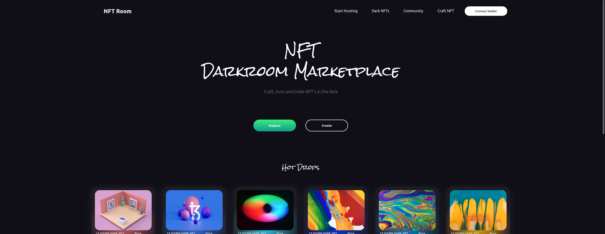

# GameNFT Marketplace
<!-- ALL-CONTRIBUTORS-BADGE:START - Do not remove or modify this section -->

<!-- ALL-CONTRIBUTORS-BADGE:END -->
Reactjs And Smart Contracts Open Source Basic Nft Marketplace App.

This is a class project for 2022 Spring CSC2125 @UofT.

## 🖥️ Screenshoots 

### Home

### Explore

### NFT Detail

## 🔮 Usage
In the project directory, you can run:

### `npm install (for first running)`
### `npm start`

## 🗞️ Docs
 - [Base Components](https://github.com/yessGlory17/nft-marketplace/blob/main/docs/design/BaseComponents.md)

<!-- markdownlint-restore -->
<!-- prettier-ignore-end -->

